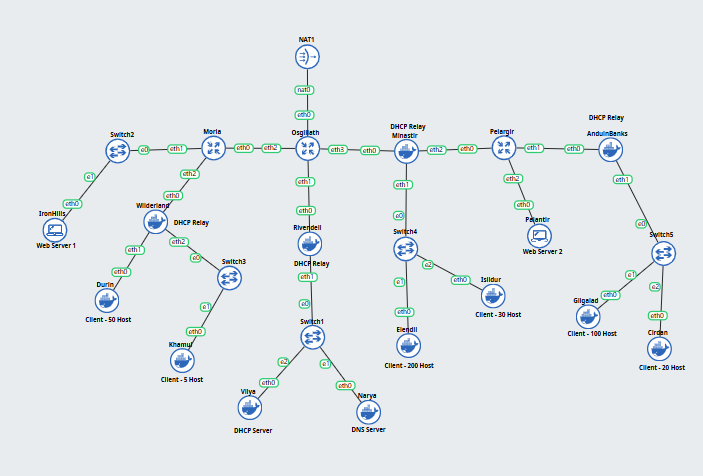
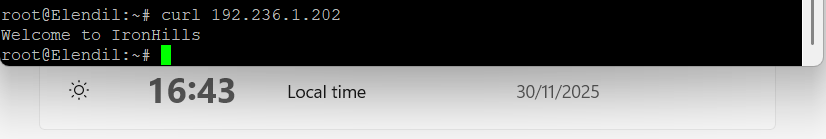
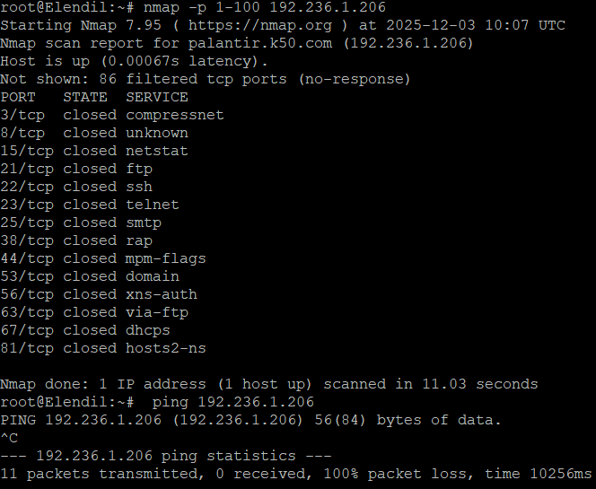
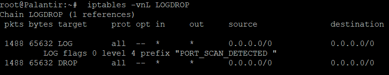
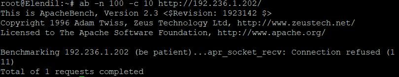

# Jarkom-Modul-5-2025-K50

## Contents
- [Jarkom-Modul-5-2025-K50](#jarkom-modul-5-2025-k50)
	- [Contents](#contents)
	- [Daftar Anggota](#daftar-anggota)
	- [Pembahasan](#pembahasan)
		- [***Prerequisite:***](#prerequisite)
			- [*Base IP Kelompok:   192.236.x.x*](#base-ip-kelompok---192236xx)
			- [*Tabel hasil VLSM:*](#tabel-hasil-vlsm)
			- [**VLSM Tree Visualization:**:](#vlsm-tree-visualization)
		- [Misi 1:](#misi-1)
			- [Misi 1-3:](#misi-1-3)
			- [Misi 1-4:](#misi-1-4)
		- [Misi 2:](#misi-2)
			- [Misi 2-1:](#misi-2-1)
			- [Misi 2-2:](#misi-2-2)
			- [Misi 2-3:](#misi-2-3)
			- [Misi 2-4:](#misi-2-4)
			- [Misi 2-5:](#misi-2-5)
			- [Misi 2-6:](#misi-2-6)
			- [Misi 2-7:](#misi-2-7)
			- [Misi 2-8:](#misi-2-8)
		- [Misi 3:](#misi-3)
			- [Misi 3-1:](#misi-3-1)

## Daftar Anggota
| Nama                    | NRP        |
| ----------------------- | ---------- |
| Rayka Dharma Pranandita | 5027241039 |
| Yasykur Khalis J M Y    | 5027241112 |
## Pembahasan
### ***Prerequisite:***
#### *Base IP Kelompok:   192.236.x.x* 
#### *Tabel hasil VLSM:*     
| Nama Subnet (Label) | Peruntukan (Lokasi)         | Network ID    | CIDR | Netmask         | Range IP Host (Usable) | Broadcast IP | Gateway (Router IP) |
| ------------------- | --------------------------- | ------------- | ---- | --------------- | ---------------------- | ------------ | ------------------- |
| A                   | Switch4 (Elendil, Isildur)  | 192.236.0.0   | /24  | 255.255.255.0   | .2 - .254              | 0,255        | 192.236.0.1         |
| B                   | Switch5 (Gilgalad, Cirdan)  | 192.236.1.0   | /25  | 255.255.255.128 | .2 - .126              | 0,127        | 192.236.1.1         |
| C                   | Switch3 (Durin, Khamul)     | 192.236.1.128 | /26  | 255.255.255.192 | .130 - .190            | 0,191        | 192.236.1.129       |
| D                   | Switch1 (Vilya, Narya)      | 192.236.1.192 | /29  | 255.255.255.248 | .194 - .198            | 0,199        | 192.236.1.193       |
| E                   | Switch2 (IronHills)         | 192.236.1.200 | /30  | 255.255.255.252 | .202 (IronHills)       | 0,203        | 192.236.1.201       |
| F                   | Pelargir Direct (Palantir)  | 192.236.1.204 | /30  | 255.255.255.252 | .206 (Palantir)        | 0,207        | 192.236.1.205       |
| A1                  | Link Osgiliath ↔ Minastir   | 192.236.1.208 | /30  | 255.255.255.252 | .209 - .210            | 0,211        | \-                  |
| A2                  | Link Minastir ↔ Pelargir    | 192.236.1.212 | /30  | 255.255.255.252 | .213 - .214            | 0,215        | \-                  |
| A3                  | Link Pelargir ↔ AnduinBanks | 192.236.1.216 | /30  | 255.255.255.252 | .217 - .218            | 0,219        | \-                  |
| A4                  | Link Osgiliath ↔ Moria      | 192.236.1.220 | /30  | 255.255.255.252 | .221 - .222            | 0,223        | \-                  |
| A5                  | Link Moria ↔ Wilderland     | 192.236.1.224 | /30  | 255.255.255.252 | .225 - .226            | 0,227        | \-                  |
| A6                  | Link Osgiliath ↔ Rivendell  | 192.236.1.228 | /30  | 255.255.255.252 | .229 - .230            | 0,231        | \-                  |

#### **VLSM Tree Visualization:**:     

     

### Misi 1:   
Pertama kita coba buat topology dalam GNS3:    
    

#### Misi 1-3:
Selanjutnya kita melakukan config sesuai dengan planning soal dan dengan pembagian IP yang telah lakukan tadi menggunakan VLSM:    

- **Osgiliath (Main Router):**    
```netconf
auto Lo
iface lo inet loopback

# Ke Internet (NAT)
auto eth0
iface eth0 inet dhcp

# Ke Rivendell (Bawah)
auto eth1
iface eth1 inet static
	address 192.236.1.229
	netmask 255.255.255.252
	# Rute ke Subnet D (Vilya/Narya) via Rivendell
	up ip route add 192.236.1.192/29 via 192.236.1.230

# Ke Moria (Kiri)
auto eth2
iface eth2 inet static
	address 192.236.1.221
	netmask 255.255.255.252
	# Rute ke Subnet C (Durin/Khamul) via Moria
	up ip route add 192.236.1.128/26 via 192.236.1.222
	# Rute ke Subnet E (IronHills) via Moria
	up ip route add 192.236.1.200/30 via 192.236.1.222
    # Rute ke Network Link Moria-Wilderland
    up ip route add 192.236.1.224/30 via 192.236.1.222

# Ke Minastir (Kanan)
auto eth3
iface eth3 inet static
	address 192.236.1.209
	netmask 255.255.255.252
	# Rute ke Subnet A (Elendil) via Minastir
	up ip route add 192.236.0.0/24 via 192.236.1.210
	# Rute ke Subnet B (Gilgalad) via Minastir
	up ip route add 192.236.1.0/25 via 192.236.1.210
	# Rute ke Subnet F (Palantir) via Minastir
	up ip route add 192.236.1.204/30 via 192.236.1.210
        	# Rute ke network link Pelargir-AnduinBanks
	up ip route add 192.236.1.216/30 via 192.236.1.210
```   
- **Moria (Router Kiri):**    
```netconf
auto lo
iface lo inet loopback

# Ke Osgiliath (Uplink)
auto eth0
iface eth0 inet static
	address 192.236.1.222
	netmask 255.255.255.252
	# Default Gateway ke Osgiliath
	up ip route add default via 192.236.1.221

# Gateway IronHills (Subnet E)
auto eth1
iface eth1 inet static
	address 192.236.1.201
	netmask 255.255.255.252

# Ke Wilderland (Downlink)
auto eth2
iface eth2 inet static
	address 192.236.1.225
	netmask 255.255.255.252
	# Rute ke Subnet C (Durin) via Wilderland
	up ip route add 192.236.1.128/26 via 192.236.1.226
``` 
- **Pelargir (Router Kanan):**:
```netconf
auto lo
iface lo inet loopback

# Ke Minastir (Uplink)
auto eth0
iface eth0 inet static
	address 192.236.1.214
	netmask 255.255.255.252
	# Default Gateway ke Minastir
	up ip route add default via 192.236.1.213

# Ke AnduinBanks (Downlink)
auto eth1
iface eth1 inet static
	address 192.236.1.217
	netmask 255.255.255.252
	# Rute ke Subnet B (Gilgalad) via AnduinBanks
	up ip route add 192.236.1.0/25 via 192.236.1.218

# Gateway Palantir (Subnet F)
auto eth2
iface eth2 inet static
	address 192.236.1.205
	netmask 255.255.255.252
```
- **DHCP Relays:**    
  - *Wilderland:*   
```netconf
auto lo
iface lo inet loopback

# eth0: Ke MORIA (Uplink/Atas) -> Sesuai Topologi
auto eth0
iface eth0 inet static
	address 192.236.1.226
	netmask 255.255.255.252
	gateway 192.236.1.225

# eth1: Ke DURIN (Direct connection - Client Subnet C)
auto eth1
iface eth1 inet static
	address 192.236.1.129
	netmask 255.255.255.192

# eth2: Ke SWITCH3 (Khamul via Switch3 - juga Subnet C)
auto eth2
iface eth2 inet static
	address 192.236.1.129
	netmask 255.255.255.192
``` 
  - *Rivendell:*    
```netconf
auto lo
iface lo inet loopback

# Ke Osgiliath (Uplink)
auto eth0
iface eth0 inet static
	address 192.236.1.230
	netmask 255.255.255.252
	# Default Gateway ke Osgiliath
	up ip route add default via 192.236.1.229

# Gateway Server Vilya/Narya (Subnet D)
auto eth1
iface eth1 inet static
	address 192.236.1.193
	netmask 255.255.255.248
```
  - *Minastir:*    
```netconf
auto lo
iface lo inet loopback

# Ke Osgiliath (Uplink)
auto eth0
iface eth0 inet static
	address 192.236.1.210
	netmask 255.255.255.252
	# Default Gateway ke Osgiliath
	up ip route add default via 192.236.1.209

# Gateway Client Elendil/Isildur (Subnet A)
auto eth1
iface eth1 inet static
	address 192.236.0.1
	netmask 255.255.255.0

# Ke Pelargir (Downlink)
auto eth2
iface eth2 inet static
	address 192.236.1.213
	netmask 255.255.255.252
	# Rute ke Subnet B (Gilgalad) via Pelargir
	up ip route add 192.236.1.0/25 via 192.236.1.214
	# Rute ke Subnet F (Palantir) via Pelargir
	up ip route add 192.236.1.204/30 via 192.236.1.214
	# Rute ke Network Link Pelargir-AnduinBanks 
	up ip route add 192.236.1.216/30 via 192.236.1.214
```
  - *AnduinBanks:* 
```netconf
auto lo
iface lo inet loopback

# Ke Pelargir (Uplink)
auto eth0
iface eth0 inet static
	address 192.236.1.218
	netmask 255.255.255.252
	# Default Gateway ke Pelargir
	up ip route add default via 192.236.1.217

# Gateway Client Gilgalad (Subnet B)
auto eth1
iface eth1 inet static
	address 192.236.1.1
	netmask 255.255.255.128
```
- Web Servers:
  - *IronHills:*
```netconf
auto eth0
iface eth0 inet static
	address 192.236.1.202
	netmask 255.255.255.252
	gateway 192.236.1.201
```    
  - *Palantir:*    
```netconf
auto eth0
iface eth0 inet static
	address 192.236.1.206
	netmask 255.255.255.252
	gateway 192.236.1.205
```
- Clients:
```netconf
auto lo
iface lo inet loopback

auto eth0
iface eth0 inet dhcp
```     
#### Misi 1-4:
Setelah selesai melakukan config, bisa melakukan instalasi dan konfigurasi service (**NOTE: Run Solver Misi 2-1 terlebih dahulu di Osgiliath untuk mendapatkan internet**):

WebServer (IronHills, Palantir):
```bash
#!/bin/bash

# 1. Set DNS ke Google dulu biar bisa apt update
echo "nameserver 8.8.8.8" > /etc/resolv.conf

# 2. Update repo dan install Nginx
apt-get update
apt-get install nginx -y

echo "Starting Nginx manually..."
if [ -f /etc/init.d/nginx ]; then
    /etc/init.d/nginx start
else
    # Fallback kalau init script ga ada/gagal
    /usr/sbin/nginx
fi

# Pastikan service status running
service nginx status || echo "Nginx status check skipped (container limitation)"

# 4. Soal Misi 1: Buat index.html berisikan "Welcome to {hostname}"
echo "Welcome to $(hostname)" > /var/www/html/index.html

# 5. Cek hasil
echo "----------------------------------------"
echo "Cek akses Localhost:"
curl localhost
echo "----------------------------------------"
echo "Instalasi Web Server di $(hostname) Selesai."
```

DHCP Relay (Minastir, AnduinBanks, Rivendell, Wilderland):
```bash
#!/bin/bash

# IP DHCP SERVER (VILYA)
TARGET_SERVER="192.236.1.194"

echo "Mengonfigurasi DHCP Relay arah ke $TARGET_SERVER..."

# 1. Pastikan DNS aman buat install
echo "nameserver 8.8.8.8" > /etc/resolv.conf
apt-get update

# 2. Install Paket (Mode Non-Interactive)
DEBIAN_FRONTEND=noninteractive apt-get install isc-dhcp-relay -y

# 3. Masukkan Konfigurasi Relay
cat > /etc/default/isc-dhcp-relay <<EOF
SERVERS="$TARGET_SERVER"
INTERFACES="eth0 eth1 eth2 eth3"
OPTIONS=""
EOF

# 4. Aktifkan IP Forwarding (Wajib bagi Relay/Router)
# Cek apakah sudah ada, kalau belum tambahkan
if ! grep -q "net.ipv4.ip_forward=1" /etc/sysctl.conf; then
    echo "net.ipv4.ip_forward=1" >> /etc/sysctl.conf
else
    sed -i '/net.ipv4.ip_forward=1/s/^#//g' /etc/sysctl.conf
fi
sysctl -p

# 5. Restart Service
service isc-dhcp-relay restart

# 6. Verifikasi
echo "----------------------------------------"
if service isc-dhcp-relay status | grep -q "Active: active"; then
    echo "[SUKSES] Relay aktif! Siap meneruskan request ke Vilya."
else
    echo "[WARNING] Service belum aktif. Coba jalankan 'service isc-dhcp-relay start' manual."
fi
```

DHCP Server (Vilya):
```bash
#!/bin/bash

echo nameserver 8.8.8.8 > /etc/resolv.conf

apt-get update
apt-get install isc-dhcp-server -y

# 1. Pastikan interface diset
sed -i 's/INTERFACESv4=""/INTERFACESv4="eth0"/g' /etc/default/isc-dhcp-server

# 2. Tulis konfigurasi dhcpd.conf
cat > /etc/dhcp/dhcpd.conf <<EOF
# Global Config
default-lease-time 600;
max-lease-time 7200;
option domain-name "k50.com";
option domain-name-servers 192.236.1.195, 8.8.8.8; # IP Narya & Google

# Subnet D (Jaringan Lokal Vilya - Wajib ada)
subnet 192.236.1.192 netmask 255.255.255.248 {
}

# Subnet A (Switch4 - Elendil/Isildur)
subnet 192.236.0.0 netmask 255.255.255.0 {
    range 192.236.0.10 192.236.0.250;
    option routers 192.236.0.1;
    option broadcast-address 192.236.0.255;
}

# Subnet B (Switch5 - Gilgalad/Cirdan)
subnet 192.236.1.0 netmask 255.255.255.128 {
    range 192.236.1.10 192.236.1.120;
    option routers 192.236.1.1;
    option broadcast-address 192.236.1.127;
}

# Subnet C (Switch3 - Durin/Khamul)
subnet 192.236.1.128 netmask 255.255.255.192 {
    range 192.236.1.130 192.236.1.190;
    option routers 192.236.1.129;
    option broadcast-address 192.236.1.191;
}
EOF

# 3. Restart Service
service isc-dhcp-server restart
service isc-dhcp-server status | grep "Active"
echo "DHCP Server Configured!"
```

DNS Server (Narya):
```bash
#!/bin/bash

echo nameserver 8.8.8.8 > /etc/resolv.conf

apt-get update
apt-get install bind9 dnsutils -y
# 1. Konfigurasi Options (Forwarder ke Google)
cat > /etc/bind/named.conf.options <<EOF
options {
        directory "/var/cache/bind";
        forwarders {
                8.8.8.8;
        };
        dnssec-validation auto;
        listen-on-v6 { any; };
        allow-query { any; };
};
EOF

# 2. Konfigurasi Zone (Local)
cat > /etc/bind/named.conf.local <<EOF
zone "k50.com" {
        type master;
        file "/etc/bind/jarkom/k50.com";
};

zone "1.236.192.in-addr.arpa" {
        type master;
        file "/etc/bind/jarkom/1.236.192.in-addr.arpa";
};
EOF

# 3. Buat Folder & File Zone Forward
mkdir -p /etc/bind/jarkom

cat > /etc/bind/jarkom/k50.com <<EOF
;
; Forward Zone - k50.com
;
\$TTL    604800
@       IN      SOA     k50.com. root.k50.com. (
                        2023101001      ; Serial
                        604800          ; Refresh
                        86400           ; Retry
                        2419200         ; Expire
                        604800 )        ; Negative Cache TTL
;
@       IN      NS      narya.k50.com.
@       IN      A       192.236.1.195   ; IP Narya
narya   IN      A       192.236.1.195
vilya   IN      A       192.236.1.194
ironhills IN    A       192.236.1.202
palantir  IN    A       192.236.1.206
www       IN    CNAME   ironhills       ; Alias www ke IronHills
EOF

# 4. Buat File Zone Reverse
cat > /etc/bind/jarkom/1.236.192.in-addr.arpa <<EOF
;
; Reverse Zone (Subnet Server 192.236.1.x)
;
\$TTL    604800
@       IN      SOA     k50.com. root.k50.com. (
                        2023101001      ; Serial
                        604800          ; Refresh
                        86400           ; Retry
                        2419200         ; Expire
                        604800 )        ; Negative Cache TTL
;
@       IN      NS      narya.k50.com.
195     IN      PTR     narya.k50.com.
194     IN      PTR     vilya.k50.com.
202     IN      PTR     ironhills.k50.com.
206     IN      PTR     palantir.k50.com.
EOF

# 5. Restart Service (Paksa start binary manual jika service gagal)
if [ -f /usr/sbin/named ]; then
    /usr/sbin/named -u bind
fi
service bind9 restart
echo "DNS Server Narya (k50.com) Siap!"
```

Coba jalankan WebServer:


### Misi 2:   
#### Misi 2-1:    
Menghubungkan jaringan Aliansi ke internet melalui router Osgiliath tanpa menggunakan target `MASQUERADE`:
```bash
iptables -t nat -A POSTROUTING -o eth0 -j SNAT --to-source <IP_ETH0_OSGILIATH>
```


#### Misi 2-2:   
Mengamankan Vilya agar tidak bisa di-ping oleh perangkat lain, namun Vilya tetap bisa melakukan ping ke luar.

Tolak ICMP Echo Request (Ping) yang masuk ke Vilya:
```bash
iptables -A INPUT -p icmp --icmp-type echo-request -j DROP
```

Tes ping di node lain:


#### Misi 2-3:    
Memastikan hanya Vilya yang dapat mengakses layanan DNS (Port 53) pada server Narya. Akses dari node lain harus ditolak.

Konfigurasi di Narya untuk hanya mengizinkan Vilya:
```bash
#!/bin/bash
IP_VILYA="192.236.1.194"

echo "Menghapus aturan-aturan Iptables untuk isolasi DNS..."
# --- 1. Hapus aturan DROP akses DNS (TCP/UDP) dari IP lain ---
iptables -D INPUT -p udp --dport 53 -j DROP
iptables -D INPUT -p tcp --dport 53 -j DROP

# --- 2. Hapus aturan ALLOW akses DNS (TCP/UDP) dari Vilya ---
iptables -D INPUT -p udp --dport 53 -s $IP_VILYA -j ACCEPT
iptables -D INPUT -p tcp --dport 53 -s $IP_VILYA -j ACCEPT

# --- 3. Verifikasi Rule ---
echo "Aturan DNS yang dihapus seharusnya tidak lagi muncul:"
iptables -L INPUT -n | grep "dpt:53"

# --- 4. Jalankan Service (jika perlu mereset status) ---
echo "restart service named..."
service named restart
```

Install `netcat` di Narya untuk uji akses. Lakukan hal yang sama di node lain:
```bash
#!/bin/bash

IP_NARYA="192.236.1.195"

# 1. Cek & Install Netcat jika belum ada
if ! command -v nc &> /dev/null; then
    echo "[INFO] Netcat tidak ditemukan. Memulai instalasi..."

    # Pastikan bisa resolve DNS Google untuk download
    echo "nameserver 8.8.8.8" > /etc/resolv.conf

    apt-get update
    # Menginstall netcat (versi openbsd yang umum dipakai)
    apt-get install netcat-openbsd -y
else
    echo "[INFO] Netcat sudah terinstal."
fi

echo "MULAI PENGUJIAN AKSES KE NARYA ($IP_NARYA)"
echo "Target: Port 53 (DNS)"

echo "[TEST UDP] nc -z -v -u $IP_NARYA 53"
echo "[TEST TCP] nc -z -v $IP_NARYA 53"
```


("UDP Succeeded" untuk node lain hanya berupa false positive)

#### Misi 2-4:   
Melakukan pengaturan agar IronHills hanya
boleh diakses pada Akhir Pekan (Sabtu & Minggu)    

Hal ini bisa dilakukan dengan mengatur iptables:
Hal ini bisa dilakukan dengan menambahkan iptables:
```bash
iptables -A INPUT -p tcp --dport 80 -s $IP_KURCACI -m time --weekdays Sat,Sun -j ACCEPT
iptables -A INPUT -p tcp --dport 80 -s $IP_MANUSIA -m time --weekdays Sat,Sun -j ACCEPT

# Block sisa akses web
iptables -A INPUT -p tcp --dport 80 -j DROP
```    

Dimana didapatkan hasil pengujian:
- *Weekdays:* <br>

- *Weekend:* <br>
      

#### Misi 2-5:     
Melakukan pembatasan akses berdasarkan
ras:
● Faksi Elf (Gilgalad & Cirdan): Boleh akses jam 07.00 - 15.00.
● Faksi Manusia (Elendil & Isildur): Boleh akses jam 17.00 - 23.00      
    
Hal ini bisa dilakukan dengan mengatur iptables:
```bash
iptables -A INPUT -p tcp --dport 80 -s $IP_ELF -m time --timestart 07:00 --timestop 15:00 -j ACCEPT
# Rule Manusia
iptables -A INPUT -p tcp --dport 80 -s $IP_MANUSIA -m time --timestart 17:00 --timestop 23:00 -j ACCEPT
# Drop sisa web
iptables -A INPUT -p tcp --dport 80 -j DROP
```

Dengan hasil pengujian:    
- Di luar jam akses:    

- Di dalam jam akses:    
    

#### Misi 2-6:     
Melakukan pemblokiran scan port yang melebihi 15 port dalam waktu 20
detik, penyerang yang terblokir tidak dapat melakukan ping, nc, atau curl ke Palantir. Selain itu catat log iptables dengan prefix "PORT_SCAN_DETECTED"     

Hal ini dapat dilakukan dengan mengatur iptables:   
```bash
iptables -N LOGDROP
# Log packet (Level 4 warning)
iptables -A LOGDROP -j LOG --log-prefix "PORT_SCAN_DETECTED " --log-level 4
# Drop packet
iptables -A LOGDROP -j DROP

# "Kalau IP ini ada di list 'scanner' dan udah hit > 15x, update timer & TENDANG ke LOGDROP"
iptables -A INPUT -m recent --name scanner --update --seconds 20 --hitcount 15 -j LOGDROP

# "Kalau paket TCP SYN baru dateng, catat IP-nya ke list 'scanner'"
iptables -A INPUT -p tcp --syn -m recent --name scanner --set

# Kalau user normal (hitcount < 15), izinkan akses port 80 (Shift Kerja Logic bisa masuk sini nanti)
iptables -A INPUT -p tcp --dport 80 -j ACCEPT
```      

Hasil pengujian:   
- Test Nmap dan Ping:    

- Hasil Log:   

#### Misi 2-7:      
Akses ke IronHills hanya boleh berasal dari 3 koneksi aktif per IP dalam waktu
bersamaan    

Hal ini bisa dilakukan dengan mengatur firewall:   
```bash
iptables -R INPUT 1 -p tcp --syn --dport 80 -m connlimit --connlimit-above 3 -j REJECT --reject-with tcp-reset

# Jika ada yang mau connect ke port 80 (HTTP), dan dengan IP yang sama dengan koneksi concurrent di atas 3, maka akan direject dan mengirim sinyal RST
```   

Hasil pengujian:    

#### Misi 2-8:    
Setiap paket yang dikirim Vilya menuju Khamul, belokkan menuju IronHills
### Misi 3:     
#### Misi 3-1:  
Blokir semua lalu lintas masuk dan keluar dari Khamul

