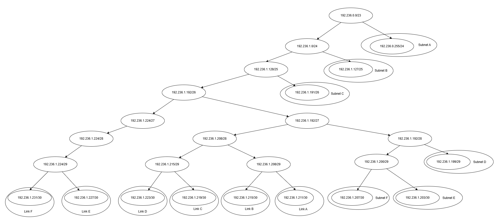

# Jarkom-Modul-5-2025-K50
## Daftar Anggota
| Nama                    | NRP        |
| ----------------------- | ---------- |
| Rayka Dharma Pranandita | 5027241039 |
| Yasykur Khalis J M Y    | 5027241112 |
## Contents
## Pembahasan
### Prerequisite
#### **Tabel hasil VLSM:**     
| Nama Subnet (Label) | Peruntukan (Lokasi)         | Network ID    | CIDR | Netmask         | Range IP Host (Usable) | Broadcast IP | Gateway (Router IP) |
| ------------------- | --------------------------- | ------------- | ---- | --------------- | ---------------------- | ------------ | ------------------- |
| A                   | Switch4 (Elendil, Isildur)  | 192.236.0.0   | /24  | 255.255.255.0   | .2 - .254              | 0,255        | 192.236.0.1         |
| B                   | Switch5 (Gilgalad, Cirdan)  | 192.236.1.0   | /25  | 255.255.255.128 | .2 - .126              | 0,127        | 192.236.1.1         |
| C                   | Switch3 (Durin, Khamul)     | 192.236.1.128 | /26  | 255.255.255.192 | .130 - .190            | 0,191        | 192.236.1.129       |
| D                   | Switch1 (Vilya, Narya)      | 192.236.1.192 | /29  | 255.255.255.248 | .194 - .198            | 0,199        | 192.236.1.193       |
| E                   | Switch2 (IronHills)         | 192.236.1.200 | /30  | 255.255.255.252 | .202 (IronHills)       | 0,203        | 192.236.1.201       |
| F                   | Pelargir Direct (Palantir)  | 192.236.1.204 | /30  | 255.255.255.252 | .206 (Palantir)        | 0,207        | 192.236.1.205       |
| A1                  | Link Osgiliath ↔ Minastir   | 192.236.1.208 | /30  | 255.255.255.252 | .209 - .210            | 0,211        | \-                  |
| A2                  | Link Minastir ↔ Pelargir    | 192.236.1.212 | /30  | 255.255.255.252 | .213 - .214            | 0,215        | \-                  |
| A3                  | Link Pelargir ↔ AnduinBanks | 192.236.1.216 | /30  | 255.255.255.252 | .217 - .218            | 0,219        | \-                  |
| A4                  | Link Osgiliath ↔ Moria      | 192.236.1.220 | /30  | 255.255.255.252 | .221 - .222            | 0,223        | \-                  |
| A5                  | Link Moria ↔ Wilderland     | 192.236.1.224 | /30  | 255.255.255.252 | .225 - .226            | 0,227        | \-                  |
| A6                  | Link Osgiliath ↔ Rivendell  | 192.236.1.228 | /30  | 255.255.255.252 | .229 - .230            | 0,231        | \-                  |    

#### **VLSM Tree Visualization:**:     

     

### Misi 1:    
### Misi 2:    
### Misi 3:   
